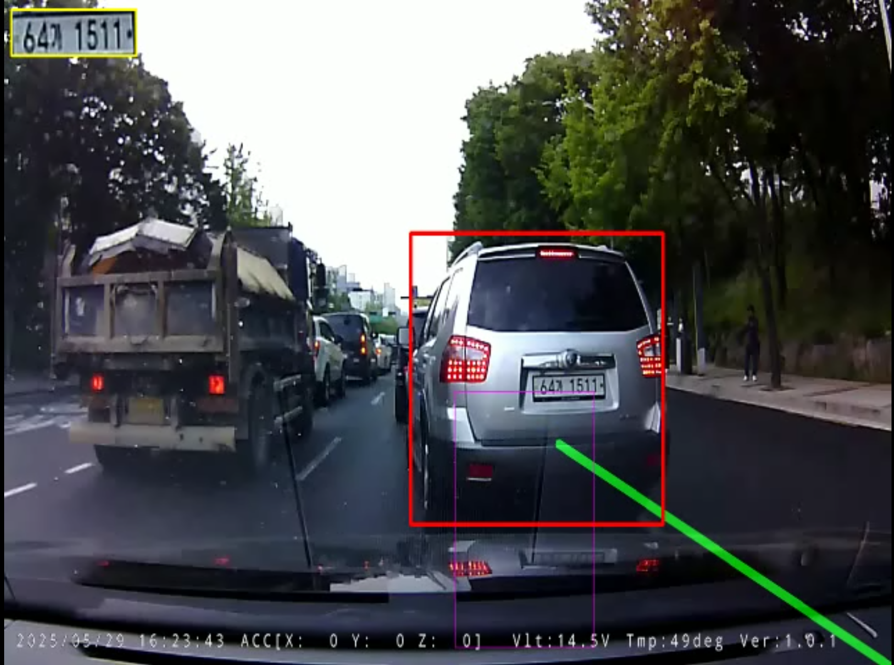
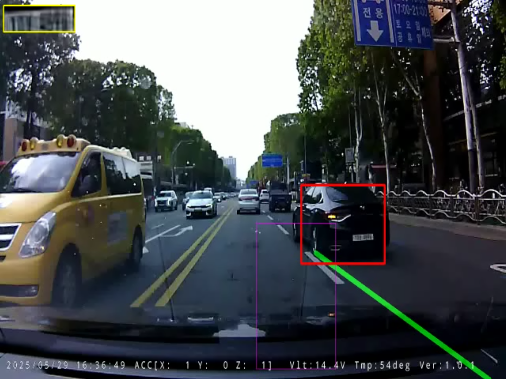

<div align="right">

**[한국어](./README.ko.md)** | **[English](./README.md)**

</div>

# 실시간 블랙박스 영상 분석을 통한 차선 이탈 차량 식별별 및 번호판 인식 시스템

## 1. 프로젝트 개요 (Introduction)

본 프로젝트는 차량용 블랙박스 영상에서 **차선을 이탈하여 진입하는 차량을 자동으로 탐지**하고, 해당 차량의 **번호판을 인식하여 텍스트로 추출**한 뒤, **시간과 함께 로그로 기록**하는 것을 목표로 하는 컴퓨터 비전 시스템입니다.

단순히 각 기능을 구현하는 것을 넘어, 실제 주행 영상에서 마주할 수 있는 다양한 문제들(예: 저해상도, 조명 변화, 객체의 다양한 각도 및 거리)을 해결하기 위해 **여러 딥러닝 모델과 고급 이미지 처리 기법들을 결합한 하이브리드 파이프라인**을 구축하여 정확도를 높이는 데 중점을 두었습니다.

## 2. 주요 기능 (Key Features)

- **안정적인 차선 감지:**
  - OpenCV의 허프 변환을 기반으로 차선을 식별합니다.
  - **시간적 스무딩(Temporal Smoothing)** 기법을 `collections.deque`를 이용해 구현하여, 주행 중 발생하는 차선의 미세한 떨림을 최소화하고 안정적인 차선 인식을 유지합니다.

- **하이브리드 딥러닝 모델 파이프라인:**
  - **차량 식별 (CPU 기반):** 전체 영상에서 차량을 빠르게 찾아내기 위해 가벼운 `YOLOv3-tiny` 모델을 CPU에서 실행하여 시스템의 기본적인 반응 속도를 확보했습니다.
  - **번호판 위치 식별 (GPU 기반):** 차량으로 특정된 영역 안에서 번호판의 정확한 위치를 찾기 위해, 한국어 번호판에 특화된 **YOLOv5** 모델을 GPU에서 가속하여 실행합니다. 이를 통해 번호판 위치 탐색의 정확도를 극대화했습니다.
  - **번호판 문자 인식 (GPU 기반):** 전통적인 Tesseract OCR 대신, 딥러닝 기반의 **EasyOCR** 라이브러리를 GPU에서 실행하여 문자 인식의 정확도와 속도를 모두 향상시켰습니다.

- **지능형 번호판 처리 기술:**
  - **자동 번호판 보정:** YOLOv5로 식별된 번호판이 기울어져 있더라도, **투시 변환(Perspective Transform)**을 통해 반듯한 직사각형 이미지로 자동 보정하여 OCR의 입력 품질을 높입니다.
  - **초해상도 (Super-Resolution):** 멀리 있어 작고 흐릿한 번호판 이미지의 품질을 개선하기 위해, 딥러닝 기반의 **EDSR 초해상도 모델**을 적용하여 OCR 인식률을 높이는 고급 기법을 구현했습니다.
  - **다수결 시스템 (Temporal Voting):** 여러 프레임에 걸쳐 불안정하게 인식되는 OCR 결과들을 모아, **문자 단위 다수결 투표**를 통해 가장 신뢰도 높은 최종 번호판을 확정하는 로직을 구현하여 결과의 안정성을 확보했습니다.

- **고도화된 객체 추적 (Object Tracking):**
  - 차선에 진입한 특정 차량을 놓치지 않고 안정적으로 따라가기 위해 OpenCV의 **CSRT 추적기**를 도입했습니다.
  - 추적기는 YOLO 차량 식별기와 유기적으로 연동되어, 주기적으로 위치를 보정받으면서 효율적이고 안정적인 추적을 수행합니다.

- **사용자 편의 기능:**
  - 모든 처리 결과가 반영된 최종 영상을 `.avi` 파일로 저장합니다.
  - `ESC` 키로 언제든지 프로그램을 안전하게 종료할 수 있습니다.

## 3. 데모 및 실행 결과 (Demonstration)

#### 실행 화면 예시

프로그램이 동작할 때의 모습입니다. 차선(녹색 선), 차선 내 영역(얇은 보라색 상자), 감지된 차량(초록색 상자), 추적 대상 차량(빨간색 상자), 확정된 번호판(노란색 텍스트), 그리고 좌측 상단의 번호판 디버그 뷰를 확인할 수 있습니다.

<table>
  <tr>
    <td align="center"></td>
    <td align="center"></td>
  </tr>
</table>
<table>
  <tr>
    <td align="center"></td>
    <td align="center"></td>
  </tr>
</table>


#### 로그 파일 출력 예시 (`log.txt`)

최종적으로 번호판이 확정되면, 아래와 같이 시간과 함께 `log.txt` 파일에 기록됩니다.

```
번호판: 64가1511 (대상 차량 크기: 298x258)
```

## 4. 시스템 아키텍처 (System Architecture)

본 시스템은 다음과 같은 파이프라인 구조로 동작합니다.

```
[영상 프레임 입력]
      |
      +-----> 1. 차선 감지 (OpenCV, CPU) & 시간적 스무딩
      |
      +-----> 2. 차량 식별 (YOLOv3-tiny, CPU)
      |
      +-----> 3. 차선 내 진입 차량 판단 (IoU 기반) & 추적 시작/갱신 (CSRT Tracker)
                |
                +-----> 4. 번호판 위치 식별 (YOLOv5, GPU)
                          |
                          +-----> 5. (선택) 초해상도(SR)로 화질 개선 (GPU)
                                    |
                                    +-----> 6. 문자 인식 (EasyOCR, GPU)
                                              |
                                              +-----> 7. 다수결 투표로 최종 번호판 확정
                                                        |
                                                        +-----> [최종 결과 출력 및 로그 저장]
```

## 5. 설치 및 실행 방법 (Installation & How to Run)

#### 사전 요구사항
* **Python 3.10**
* **NVIDIA GPU(당신의 GPU가 지원하는지 확인하세요.)**
* **CUDA Toolkit 12.1** 및 호환되는 cuDNN

#### 환경 설정
본 프로젝트는 **Python 3.10 가상 환경**에서 테스트되었습니다.

1.  **가상 환경 생성 및 활성화:**
    ```bash
    py -3.10 -m venv venv
    venv\Scripts\activate
    ```
2.  **필수 라이브러리 설치:**
    ```bash
    # GPU용 PyTorch 설치 (CUDA 12.1 기준)
    pip install torch torchvision --index-url [https://download.pytorch.org/whl/cu121](https://download.pytorch.org/whl/cu121)

    # YOLOv5 및 EasyOCR 라이브러리 설치
    pip install yolov5 easyocr

    # 표준 OpenCV 설치
    pip install opencv-contrib-python
    ```
3.  **모델 파일 다운로드:**
    아래 파일들을 다운로드하여 프로젝트 루트 디렉터리에 저장합니다.
    * **차량 식별 모델:** `yolov3-tiny.weights`, `yolov3-tiny.cfg`, `coco.names`
    * **번호판 식별 모델:** `lp_det.pt` (또는 `best.pt`) - [sauce-git/korean-license-plate-detector](https://github.com/sauce-git/korean-license-plate-detector)
    * **초해상도 모델:** `EDSR_x4.pb` - [Saafke/EDSR_Tensorflow](https://github.com/Saafke/EDSR_Tensorflow/tree/master/models))

#### 프로그램 실행

프로젝트 폴더에서 아래 명령어를 실행합니다.
```bash
python do_catch_overliner_GPU_v11.py
```
- `ESC` 키 또는 `q` 키를 누르면 프로그램이 안전하게 종료되고, 처리된 영상과 로그 파일이 생성됩니다.

## 6. 참고 자료 및 오픈소스 (References & Open Source)

본 프로젝트는 다음과 같은 오픈소스 및 아이디어를 기반으로 제작되었습니다.

* **모델:**
  * **YOLOv3 / YOLOv3-tiny:** Joseph Redmon, Ali Farhadi ([Paper](https://pjreddie.com/darknet/yolo/))
  * **YOLOv5:** Ultralytics ([GitHub](https://github.com/ultralytics/yolov5))
  * **Korean License Plate Detector Model:** [sauce-git/EasyKoreanLpDetector](https://github.com/gyupro/EasyKoreanLpDetector)
  * **EDSR Super-Resolution Model:** Bee Lim, Sanghyun Son et al. ([Paper](https://arxiv.org/abs/1707.02921))
  *   - The pre-trained model file (`EDSR_x4.pb`) used in this project was obtained from the [Saafke/EDSR_Tensorflow](https://github.com/Saafke/EDSR_Tensorflow) repository, 원본 리포지토리는 **Apache License 2.0**을 따릅니다. 라이선스 전체 내용은 현재 리포지토리 내에 포함되어 있습니다.[Apache 2.0 License](LICENSE_of_EDSR_x4.txt)
* **라이브러리:**
  * **OpenCV:** https://opencv.org
  * **PyTorch:** https://pytorch.org
  * **EasyOCR:** https://github.com/JaidedAI/EasyOCR
* **AI 어시스턴트:**
  * AI 어시스턴트 **Google Gemini**와의 협업을 통해 아이디어 구체화, 알고리즘 설계, 코드 디버깅, 고급 기법(초해상도, 추적기, 다수결 시스템) 도입 및 `README.md` 작성 등의 도움을 받았습니다.

## 7. 한계 및 향후 개선 과제 (Limitations & Future Work)

본 프로젝트는 성공적으로 차선 이탈 차량을 탐지하고 번호판을 인식하는 시스템을 구축했지만, 실제 도로 환경의 모든 변수에 대응 및 보다 높은 정확도를 얻기 위해서는 다음과 같은 개선점들이 남아있습니다.
이에 추후 아래 방법들 및 한국어번호판 식별을 위한 가벼운 인공지능모델 구현 등을 통해 과제를 해결해보고자 합니다.

### 7-1. 전체인 아쉬운 점. 
#### 7-1-1. 저해상도 및 원거리 번호판 인식의 물리적 한계
- **한계:** 현재 시스템은 초해상도 및 다중 프레임 분석 기법을 통해 저해상도 번호판 인식률을 높였으나, 원본 영상에서 차량과의 거리가 너무 멀어 식별이 불가능한 수준의 번호판은 복원하는 데 근본적인 한계가 있습니다.
- **개선 과제:** 더 높은 해상도의 카메라나 광학 줌 기능이 있는 하드웨어를 사용하거나, 특정 거리 이내의 차량에 대해서만 인식을 시도하도록 신뢰도 범위를 설정하는 방안을 고려해보고자 합니다.

#### 7-1-2. 실시간 처리 속도와 정확도의 트레이드오프
- **한계:** 현재 시스템은 차량 식별(CPU), 번호판 식별/인식(GPU)을 사용하는 하이브리드 방식으로 효율성을 높였습니다. 하지만 모든 기능을 매 프레임마다 최고 성능으로 실행하기에는 여전히 계산 비용이 많이 듭니다.
- **개선 과제:** 모델 경량화(Quantization, Pruning) 기법을 도입하거나, 차량 식별 모델 또한 `cv2.dnn`이 아닌 PyTorch/TensorRT 등으로 실행하여 전체 파이프라인을 GPU에서 처리하면 더 높은 FPS를 확보할 수 있지 않을까 싶습니다.

#### 7-1-3. 다양한 환경에 대한 일반화 성능
- **한계:** 현재 시스템의 파라미터들은 제공된 영상(주간, 맑은 날씨)에 맞춰 튜닝되었습니다. 야간, 우천, 안개 등 다른 조명 및 기상 조건에서는 성능이 저하될 수 있습니다.
- **개선 과제:** 다양한 환경에서 촬영된 데이터를 추가로 확보하고, 각기 다른 환경에 강인하게 동작하는 전처리 기법(예: 야간 영상에 특화된 명암 대비 향상)을 추가하거나, 각 조건에 맞는 파라미터 셋을 별도로 관리하는 로직을 구현하는 것을 고려해봅니다.

#### 7-1-4. 추적 알고리즘의 고도화
- **한계:** 현재 CSRT 추적기는 한 번 타겟을 놓치면 새로운 탐색을 시작합니다. 차량이 다른 차에 의해 완전히 가려지는 등의 긴 가림(Long-term Occlusion) 상황에는 취약할 수 있습니다.
- **개선 과제:** 추적 실패 시 단순히 리셋하는 대신, 칼만 필터(Kalman Filter) 등을 결합하여 차량의 다음 위치를 예측하고, 잠시 후 다시 나타났을 때 동일 차량으로 재연결하는 등 더 지능적인 추적 로직을 구현하여 안정성을 높일 수 있습니다.

### 7-2. Output별 아쉬운 점
#### 7-2-1. v11.py Output 1/2
- **한계:** 현재 결과에서 목표 차량이 차선을 변경하고 난 일정 시간이 지난 뒤에야 차선을 넘었다는 점을 인식했다.
- **개선 과제:** 차선의 빠른 인식을 위해 차량의 바닥선 양 끝의 중앙이 아닌 전체 바닥선 양 끝을 인식 범위로 포함할 필요가 있다. 다만 이는 모델 경량화와 같이 고려해봐야한다.

#### 7-2-2. v11.py Output 2/2
- **한계:** 차량의 번호판 번호 식별이 불가하다.
- **개선 과제:** EDSR_x4를 넘는 확대 및 화질개선 모델을 제작하거나 최대한 많은 프레임을 겹쳐서 식별할 수 있는 모델이나 과정을 고려해봐야한다.

## 8. 라이선스 (License)

본 프로젝트는 [MIT License](LICENSE)를 따릅니다.
